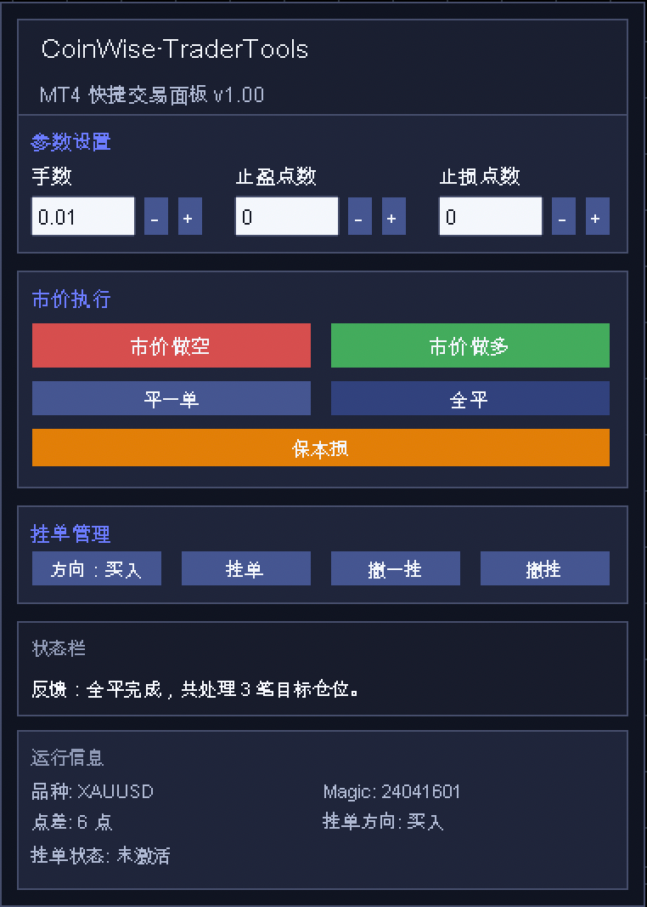

# CoinWise·TraderTools 使用说明

## 一、工具简介

`CoinWise·TraderTools` 是一个运行在 `MetaTrader 4` 图表上的快捷交易面板 EA，适合需要快速手动开仓、平仓、挂单和保本损处理的交易场景。

当前版本主要特点：

- 全中文面板
- 支持市价做多、市价做空
- 支持平一单、全平
- 支持图表选点挂单
- 支持撤一挂、撤挂
- 支持下单自动带止盈止损
- 支持一键保本损
- 支持面板位置切换
- 支持运行信息显示或隐藏

主 EA 文件：

- `CoinWise_TraderTools.ex4`



## 二、适用范围

本工具默认只处理：

- 当前图表品种
- 当前 `Magic Number` 对应的订单

这意味着它不会去误操作其他品种，或其他 EA、手工单产生的无关订单。

## 三、安装方法

### 1. 复制文件

将 `CoinWise_TraderTools.ex4` 放入 MT4 的：

```text
MQL4/Experts/
```
### 2. 挂载到图表

回到 MT4，将 `CoinWise·TraderTools` 挂到目标图表。

建议：

- 先挂到模拟盘图表测试
- 确认面板显示正常后再实盘使用

## 四、参数说明

当前参数比较精简，主要如下。

### `magic_number`

魔术号，用于标识本工具创建和管理的订单。

建议：

- 一个交易面板固定一个 `magic_number`
- 如果你在多个图表或多个策略同时使用，建议区分不同魔术号

### `slippage_points`

允许滑点，单位为点。

作用：

- 下单或平仓时允许的价格偏差范围
- 数值越小，成交要求越严格
- 数值越大，成交更容易，但成交价可能偏离更多

### `panel_corner_mode`

面板显示位置。

可选值：

- `0`：左上角
- `1`：右上角
- `2`：左下角
- `3`：右下角

### `show_info_section`

是否显示运行信息模块。

可选值：

- `true`：显示
- `false`：隐藏

## 五、面板结构说明

当前面板主要分为 5 个区域：

### 1. 标题区

显示：

- `CoinWise·TraderTools`
- `MT4 快捷交易面板`

### 2. 参数设置

用于设置：

- 手数
- 止盈点数
- 止损点数

### 3. 市价执行

包含：

- 市价做空
- 市价做多
- 平一单
- 全平
- 保本损

### 4. 挂单管理

包含：

- 方向：买入 / 卖出
- 挂单
- 撤一挂
- 撤挂

### 5. 底部信息区

包含：

- 状态栏
- 反馈信息
- 运行信息（可隐藏）

## 六、参数输入方式

### 1. 手数

默认值：

- `0.01`

最小值：

- `0.01`

你可以：

- 直接点击输入框输入
- 通过 `- / +` 按钮增减

### 2. 止盈点数

表示订单创建后自动附带的止盈距离，单位为点。

例如：

- `300` 表示止盈 300 点

### 3. 止损点数

表示订单创建后自动附带的止损距离，单位为点。

例如：

- `300` 表示止损 300 点

### 4. `- / +` 按钮

用于快速调整：

- 手数
- 止盈点数
- 止损点数

适合不想手动输入时快速操作。

## 七、市价执行功能教学

### 1. 市价做多

使用步骤：

1. 设置好手数
2. 设置止盈点数、止损点数
3. 点击 `市价做多`

结果：

- 系统会在当前图表品种立即发起买单
- 如果止盈止损不为 `0`，会自动带上止盈止损

### 2. 市价做空

使用步骤：

1. 设置好手数
2. 设置止盈点数、止损点数
3. 点击 `市价做空`

结果：

- 系统会在当前图表品种立即发起卖单
- 如果止盈止损不为 `0`，会自动带上止盈止损

### 3. 平一单

作用：

- 平掉当前图表品种下，符合本工具 `magic_number` 的一笔目标仓位

当前规则：

- 默认处理最新一笔目标仓位

### 4. 全平

作用：

- 平掉当前图表品种下，本工具管理范围内的全部目标仓位

适用场景：

- 快速清仓
- 异常行情中的风控处理

### 5. 保本损

作用：

- 将止损移动到接近开仓成本的位置

特点：

- 会考虑当前点差
- 会考虑平台最小止损距离
- 不是简单把止损改到开仓价，而是尽量避免一移动就被扫掉

适用场景：

- 仓位已有浮盈
- 想把风险收缩到接近零

## 八、挂单功能教学

### 1. 挂单方向

按钮：

- `方向：买入`
- `方向：卖出`

作用：

- 用于指定挂单时的方向逻辑

### 2. 挂单

使用步骤：

1. 设置手数
2. 设置止盈点数、止损点数
3. 选择挂单方向
4. 点击 `挂单`
5. 在主图 K 线区域点击目标价格

结果：

- 系统会根据你点击的价格和当前市场价格关系
- 自动判断应下哪种挂单
- 并自动带上止盈止损

注意：

- 点击 `挂单` 后，不要直接在面板上乱点
- 应该去主图价格区域点选挂单位置

### 3. 撤一挂

作用：

- 撤销当前图表品种下，本工具管理范围内最新的一笔挂单

### 4. 撤挂

作用：

- 撤销当前图表品种下，本工具管理范围内所有挂单

适用场景：

- 挂错位置后快速清空
- 行情变化后集中撤销旧挂单

## 九、反馈与运行信息说明

### 1. 状态栏

主要用于显示当前操作结果。

例如：

- 下单成功
- 撤挂成功
- 保本损完成
- 参数输入错误
- 没有可处理仓位

### 2. 运行信息

显示内容通常包括：

- 品种
- Magic
- 点差
- 挂单方向
- 挂单状态

如果你不需要这个区域，可以把参数：

- `show_info_section`

改成：

- `false`

## 十、常见使用场景

### 场景 1：快速做多

1. 输入手数
2. 设置止盈止损点数
3. 点击 `市价做多`

### 场景 2：价格到位前先挂单

1. 设置手数和止盈止损
2. 切换 `方向：买入` 或 `方向：卖出`
3. 点击 `挂单`
4. 在图表上点击目标价格

### 场景 3：已有利润后锁定风险

1. 持仓已有一定浮盈
2. 点击 `保本损`
3. 系统尝试把止损推到更安全的位置

### 场景 4：快速处理错误挂单

1. 点击 `撤一挂`
2. 或点击 `撤挂`

## 十一、常见问题

### 1. 为什么按钮点了没反应？

先检查：

- 是否允许 EA 交易
- 图表是否已正确加载 EA
- 参数是否填写合法
- 当前是否有可操作订单

### 2. 为什么无法挂单？

常见原因：

- 没有在主图价格区域点击
- 止盈止损距离不符合平台限制
- 挂单价格不合法
- 点差或平台限制导致失败

### 3. 为什么保本损没有生效？

可能原因：

- 当前没有可处理仓位
- 浮盈还不够
- 当前止损已经在更优位置
- 平台最小止损距离限制

### 4. 为什么运行信息不显示？

请检查参数：

- `show_info_section`

如果它是：

- `false`

则运行信息模块会被隐藏。

## 十二、使用建议

- 先在模拟盘测试所有按钮逻辑
- 不建议第一次直接在实盘高仓位使用
- 开仓前先确认：
  - 手数
  - 止盈点数
  - 止损点数
  - 挂单方向
- 多图表使用时建议区分 `magic_number`
- 发生异常行情时优先使用：
  - `全平`
  - `撤挂`

## 十三、版本建议

如果你后续还要继续优化，这个工具下一步比较值得加的方向有：

- 分批平仓
- 一键撤销全部挂单和仓位的组合动作
- 面板参数记忆
- 更强的风控模式
- 更丰富的挂单方式

如果你愿意，我下一步还可以继续帮你补一份：

- `参数说明简表`
- 或者 `新手快速上手版 1 页文档`
